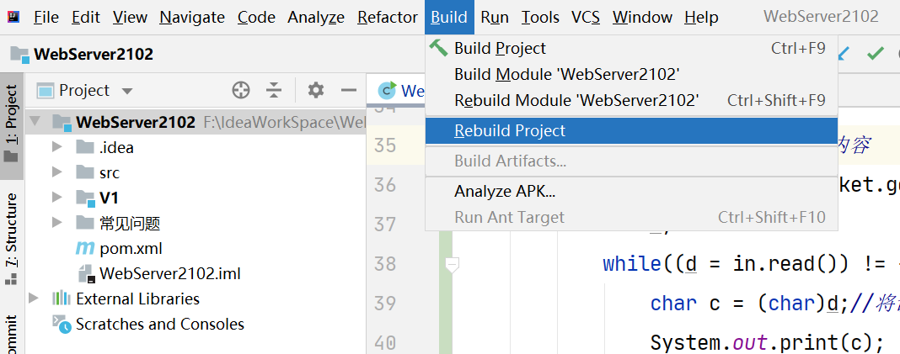
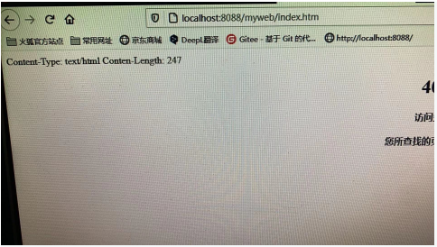

# WebServer项目常见问题

### 1:项目创建后无法新建包或类

原因:项目下的src/main/java目录不是源码目录,将其设置为源码目录即可.

如图:如果右键java目录选择new后没有右侧菜单中的Java Class就说明这个java目录不是源码目录了(图标不是蓝色)

##### 步骤一:

idea菜单顺序选择file->Project Struture

##### 步骤二:

弹出框中依次选择

1. Modules
2. 中间一栏选择不能创建类的项目(图上的是V1)
3. 右侧选择Sources,然后下面找到对应的java目录,并选择Sources(蓝色图标)的源码目录,即可. 

### 2:运行程序控制台显示无法加载主类

如图:

解决办法:

重构项目,通常就可以解决问题:选择菜单栏上的Build->Rebuild Project.

重构后在尝试运行.

### 3:浏览器输入路径请求服务端后,服务端输出的内容是乱码

原因:浏览器地址栏中的路径协议用的是https.

解决:浏览器地址栏输入地址时,前面以http开始即可.

### 4:启动WebServer后控制台报错

这个错误是端口被占用了.WebServer实例化时指定的端口(8088)

原因:通常是由于服务端启动了两次导致的.

解决:将之前的服务端关闭后再启动.经常是因为例如:V1的启动没有关闭,然后创建新版本V2后再启动V2的WebServer时报错.此时要先将原V1的WebServer关闭

### 5:程序启动后出现下图错误

原因:复制上一个版本的java目录时，粘贴到当前版本的java目录中了.

解决:将上一个版本的java目录粘贴到当前版本的main目录中覆盖java目录

### 6:浏览器请求服务端后，服务端出现下面错误

对应的报错代码为:

原因:由于浏览器发送了空请求

解决:关闭浏览器重新启动并访问，或换一个浏览器访问，或等待后期版本服务端忽略空请求来解决

## 7:浏览器请求后出现下面错误

原因:

可能的原因有两种

1:HttpRequest解析请求时，没有将请求所有内容读取完毕(请求行和消息头)，要检查代码

2:发送响应时Content-Type的值与实际发送的响应正文长度不一致。检查这两部分的发送工作

## 8:浏览器输入一个路径发起请求后，服务端出现如下错误

原因:系统找不到指定的文件是一个名为favicon.ico的文件。这是浏览器的自发行为，请求服务端的一个图标。

解决:要么响应404，要么准备一个.ico的图标文件放在webapps目录下即可。

## 9:启动WebServer时idea弹出提示框

解决:将Use classpath of modules选项中选择当前项目版本即可

## 10:浏览器请求服务端后,出现如下错误

原因:通过request获取的抽象路径定位到了webapps目录,

​         这由于浏览器地址栏输入的:http://localhost:8088/(这里没有输入内容)

​         而目录是无法读取并响应给客户端的

解决:在ClientHandler处理请求的环节,通过抽象路径实例化File时要判断表示的不是一个目录才响应

## 11:浏览器请求服务端后,展现的内容如下

原因:发送的响应未按照HTTP协议的要求发送.

解决:检查发送响应代码,看看是否有丢失或多发了CRLF这样的操作

​        并且图上还有一个错误,Content-Length的响应头名字拼写错误,这可能还导致页面展示的是源代码

## 12:ClientHandler出现下面错误

原因:

1:导包错误,导入的不是com.webserver.http包下自己定义的HttpResponse

2:HttpResponse没有提供构造方法

以上哪种要看idea提示的是哪种错误.

